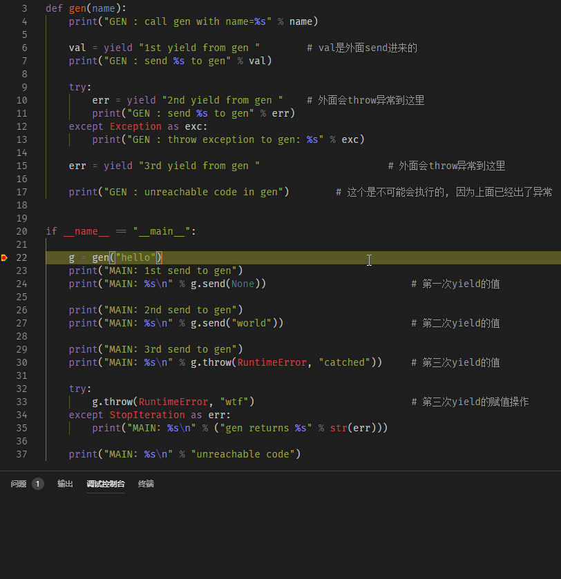
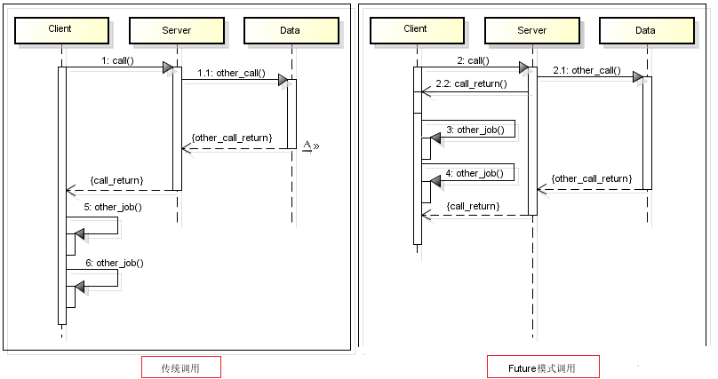
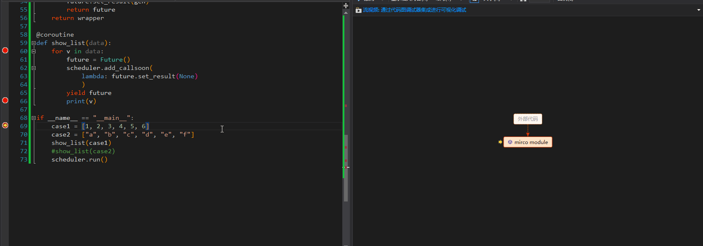
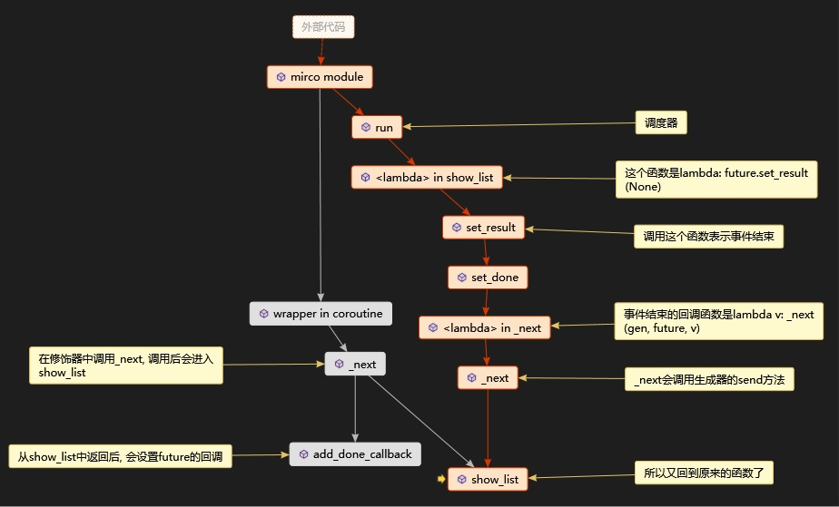
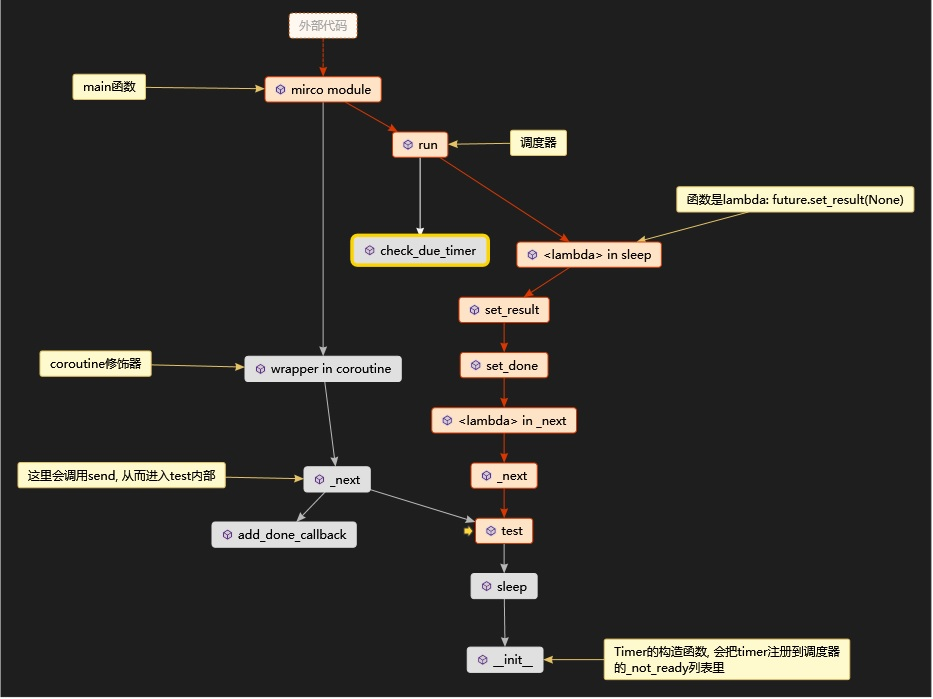

# 从生成器到异步IO: 自己实现Python协程框架（一）

## 前言

协程是一个古老的概念

## 结构

Python的协程主要包括4个部分(PS: 除了生成器和Future, 其他的名字都是我起的, 所以大家不用纠结于概念...):

- 生成器, 也就是yield, 包含这个关键字的函数都是一个协程
- 调度器, 它决定了每个协程何时运行，何时挂起
- Future, 它代表了某个未来的事件, 这个事件的结果就是Future的result
- 任务驱动器, 它驱动着协程挂起与唤醒

接下来的文字, 会依次讲解这些模块, 然后用搭积木的方式，来实现一个基于生成器的协程框架。

### 生成器

在python语法里, 只要在函数体中出现了`yield`关键字, 那么这个函数, 就是一个协程。调用这个函数的话, 会*直接*返回一个生成器(`generator`) 比如说:

```python
# test就是一个协程
def test(name):
    print("call test function")     # 1   直接调用test并不会执行
    x = yield name                  # 2
    print(x)                        # 3
    return x                        # 4

gen = test("lucy")
print(type(gen))        # <class 'generator'>
```

既然调用协程函数, 并不会执行函数体中的代码, 那么如何让这个协程运行起来呢？ 其实生成器对象有两个方法可以让协程运行起来

```python
# 接上面的代码片段
gen = test("lucy")
name = gen.send(None)          # 进入test内部, 在 2 处挂起, 同时把name返回, 也就是说, name="lucy"
gen.throw(RuntimeError)        # 向生成器抛出一个异常, 代码会回到2的位置
```

send/throw操作会让协程从上一次`yield`的位置(或者函数第一行)开始执行, 遇到`yield`后, send/throw会立即返回, 其返回值就是`yield`右侧的值。 如果遇到了`return`, 则会抛出`StopIteration`异常, `return`的值就包含在这个异常里面。

在`examples/generators.py`中有个涵盖了生成器所有特性的例子, 下图展示了生成器的执行过程(相当的绕...)



总结一下生成器的特性:

1. `yield`关键字会让生成器挂起, 保存当前的调用栈, 然后把yield右侧的对象返回
2. 生成器`send`方法会唤醒生成器, 生成器函数会从上次挂起的位置继续执行, 同时把send的参数赋值给`yield`左侧的变量
3. 生成器`throw`方法也会唤醒生成器, 生成器函数会从上次挂起的位置继续执行, 同时向生成器函数抛出一个异常, 如果这个异常没有被捕获, 那么生成器会彻底退出。
4. 如果生成器内部出现了没有被捕获的异常(包括`throw`抛出的异常), 那么调用`send`/`throw`方法的函数, 也会跟着生成器函数一起退出
5. 生成器函数唤醒后, 会一直往下执行, 直到遇见`yield`而返回, 或者出现异常而退出
6. 当生成器函数执行完`return`语句后, 会抛出一个`StopIteration`, return的值就在`StopIteration.value`中。

以上就是生成器的最重要(全部?)特性, 后面会用到这些特性来实现协程框架。

#### Stupid Coroutine

讲完了生成器, 在讲其他模块之前, 先来实现一个很蠢的协程。我们知道, 协程的核心在于`协`, 这个字表示大家(函数)相互协作, 不要一直占用着CPU, 用了一段时间就让出CPU, 交给其他函数。这样, 在愚蠢的人类看来, 这些函数都是同时运行的。

基于生成器的几个特性, 我们可以用很蠢的办法来实现上面的功能, 比如说下面的代码

```python
# examples/stupid_coroutine.py
def create_data(name, count):
    return ["%s   %d" % (name, i) for i in range(count)]

def show_list(data):    # version 1
    for v in data:
        yield
        print(v)

def main():
    gen_abc = show_list(create_data("abc", 5))
    gen_123 = show_list(create_data("123", 5))
    while True:
        try:
            gen_abc.send(None)       # 必须要手动调用send, 协程才会继续往下执行
            gen_123.send(None)       # 有没有办法自动调用send呢？
        except StopIteration:
            break

main()
```

输出结果是

```text
abc   0
123   0
abc   1
123   1
abc   2
123   2
abc   3
123   3
abc   4
123   4
```

为什么说上面的代码很蠢呢？——因为必须要手动地调用`send`方法, 协程才会继续往下执行。 那么问题来了：

**有没有办法让协程自动地往下执行, 也就是自动地调用`send`方法呢？**

肯定是有的，答案就是上面提到的——`任务驱动器`, 有了它, 协程才会自动地一步步往下执行。

说明一下, 虽然这里引出了`任务驱动器`的概念, 但是在介绍它之前, 先讲一个与它相关的概念。

### Future

Future对象, 不是协程独有的概念, 但是一般会出现在异步/并发编程领域里。比如说, 在python的`concurrent`模块中, 就有Future类的实现。 那么这个Future到底是何方神圣？

简单地说: Future代表着现在的某个事件在未来产生的结果, 我们可以不用等待这个结果的产生, 而直接返回一个Future对象。 比如说, 请求web内容就是一个事件, 返回的数据就是结果, 但是我们要等数据返回。现在有了Future, 在发起HTTP请求后, 我们不用等待HTTP响应, 而可以直接返回`Future`对象, 同时把处理HTTP响应的代码添加到Future的回调里。 比如说下面的伪代码:

```py
# 同步的写法
def httpclient(url):
    data = sendreq(url)
    handle_resp(data)
# 异步的写法
def httpclient(url):
    sendreq(url)
    future = Future()
    future.add_done_callback(handle_resp)   # 将处理resp的函数加入到future的回调
    return future
```

下面一张图说明了Future模式和传统同步模式的区别


Future对象其实非常简单, 核心的三元素是:

- 状态, 表示未来那个结果是否已经产生了
- 结果值, 代表未来产生的结果
- 回调函数, 当结果产生时, 会调用这些函数

知道了Future的几个特性, 我们就能很容易地实现一个Future类

```python
class Future:
    def __init__(self):
        self._done = False      # 状态, 表示是否结束了
        self._callbacks = []    # 事件结束时的回调函数
        self._result = None     # 结果

    def add_done_callback(self, cb):
        self._callbacks.append(cb)

    def set_result(self, r):    # 事件的结果什么时候产生, 就什么时候调用这个方法
        self._result = r        # 反过来, 什么时候调用了这个方法, 就意味着什么时候事件有了结果
        self.set_done()

    def set_done(self):
        self._done = True
        for cb in self._callbacks:
            cb(self)
```

那么什么情况会用到这个Future对象呢——Future一般都是函数的返回值, 这个返回值既指`return`返回的, 也包括`yield`返回的。 到这里, 终于把Future和前面说的`yield`关键字联系起来了。

回到`Stupid Coroutine`小节里最后的那个问题：

**有没有办法让协程自动地往下执行, 也就是自动地调用`send`方法呢？**

现在有了Future, 之前的`show_list`函数可以改写为下面的样子。

```python
def show_list(data):        # version 2
    for v in data:
        future = Future()
        # 这里还缺一些代码, 后文会解释。
        yield future
        print(v)
```

这里的Future代表了某个未来事件的结果, 我们并不用关心这个事件是什么, 需要关心的是下面两个问题:

- 这个结果什么时候产生
- 这个结果产生后, 需要做什么事(执行什么样的回调函数)

回到我们的应用场景, 我们需要的是: `show_list`在`yield`返回后, 能够自动地回到上次yield的地方。一个很自然的联想就是, 当事件事件结果产生时, 在回调函数里面调用生成器的`send`方法, 这样就能够回到上次yield出去的地方了。 这个就是`任务驱动器`最核心的思想。

嗯， 道理大家都懂，但是代码怎么写呢？请继续往下看

### 任务驱动器

它, 就像汽车的发动机一样, 持续地驱动生成器不断地向下执行, 直到终点。 根据上面的分析, 现在生成器yield出来的是Future对象, 我们需要`gen.send(val)`这样的函数添加到Future对象的回调里去。

```python
def _next(gen, value=None):
    # 这里的gen, 就是协程函数调用返回的。 比如说上面的show_list()
    # value是send函数的参数, 是一个Future对象
    try:
        val = value if not value else value._result
        fut = gen.send(val)     # yield出来的是future对象

        def cb(v):                  # 当fut代表的事件有了结果后, 就会调用这个函数。
            _next(gen, v)           # 在_next里会调用send方法...

        fut.add_done_callback(cb)  
    except StopIteration:
        pass
```

那么, 调用生成器函数的代码, 就需要这么写

```python
def call_gen():
    future = Future()
    gen = show_list()
    _next(gen, None)
    return future
```

为了避免重复劳动, 可以把上面几行代码封装成一个装饰器

```python
from functools import wraps
from types import GeneratorType
def coroutine(func):
    @wraps(func)
    def wrapper(*args, **kwargs):
        future = Future()
        gen = func(*args, **kwargs)
        if isinstance(gen, GeneratorType):
            _next(gen)
            return future
        future.set_result(gen)
        return future
    return wrapper
```

如果有大家兴趣的话, 可以看看tornado和asyncio的源码, 都能看到和`coroutine`功能类似的代码, 当然它们的代码要比我们这里的复杂很多。 这里就不贴代码了, 贴上两个链接, 有兴趣的话, 可以去看看。

- [tornado/gen.py#L202](https://github.com/tornadoweb/tornado/blob/master/tornado/gen.py#L202)
- [asyncio/tasks.py#L251](https://github.com/python/cpython/blob/master/Lib/asyncio/tasks.py#L251)

到此为止, 生成器的驱动问题解决了, 也回答了上文中的第二个问题

> 这个结果产生后, 会发生什么事(执行什么样的回调函数)

那么, 第一个问题的答案是什么？

> 这个结果什么时候产生

答案就是：`调度器`决定了每个事件的结果何时产生。

### 调度器

这个名字其实是我起的, 所以概念不重要, 只需要了解这个模块的功能是什么样就行了。 在协程的层次上说, 调度器掌握着每个协程的生老病死, 什么时候运行、 什么时候挂起, 都调度器决定, 听着很高端; 但是在future对象的层次上来说, 调度器就只决定了future代表的事件什么时候结束, 也就是什么时候去调用`future.set_result`。

这个调度器, 一般都是一个死循环, serve forever, 直到线程/进程退出。 就像CPU一样, 开机后一直工作, 直到关机。所以, 我们可以这么设计调度器

```python
from functools import partial


class Scheduler:
    def __init__(self):
        # 这里将事件分为两部分, 一部分是即将/立刻/马上要结束的事件, 这些事件对应的future
        # 信息存储在_ready, 另一部分是需要等待一段时间才结束的事件, 存储在_not_ready
        # 注意, 这里存储的并不是future对象本身, 而是包含了future信息的函数
        self._ready = []
        self._not_ready = []

    def add_callsoon(self, cb, *args, **kw):    # 把即将结束的事件, 添加到_ready
        fn = partial(cb, *args, **kw)
        self._ready.append(fn)

    def run(self):
        while self._ready:
            cb = self._ready.pop()
            cb()
```

有了`Scheduler`后, `show_list`函数的完整代码:

```python
scheduler = Scheduler()
@coroutine
def show_list(data):        # version 3
    for v in data:
        future = Future()
        # 这里就是version 2中缺少的代码
        scheduler.add_callsoon(
            lambda: future.set_result(None) #set_result(None)代表着事件结束
            )
        yield future
        print(v)
```

注意`lambda: future.set_result(None)` 这段代码, `future.set_result(None)`表示事件已经结束, 根据上文驱动器的设计, 事件结束意味着调用生成器的`send`方法, 调用`send`方法意味着生成器又会回到yield出去的地方开始执行... 周而复始, 直到生成器退出(抛出`StopIteration`)。

那么, 第一个问题

> 这个结果什么时候产生

也有了答案： 什么时候把future添加到scheduler的_ready队列里, 这个结果就什么时候产生。

[simple_coroutine.py](examples/simple_coroutine.py) 是这一小节的代码, 大家可以试着执行以下, 看调用过程。这里有一张上面代码的调用过程动图, 一图胜千言, 图中显示了代码跳转逻辑和产生的调用关系, 与我们之前的分析设计是一致的。



当代码停在`print(v)` 这一行时, 我们分析下生成的调用堆栈图



1. 在main函数中执行`show_list(case1)`后, 会进入修饰器中的`wrapper`函数
2. 在`wrapper`中发现`show_list`是一个协程(返回的是生成器), 那么会调用`_next`函数
3. 在`_next`函数中, 会调用生成器的`send`方法, 从而进入`show_list`函数内部
4. 在`show_list`内部, 会将future添加到调度器的`_ready`列表, 表示这个事件即将结束。在遇到`yield`之后, 会退出该函数, 这时调用栈又回到了`_next`函数
5. 在`_next`函数中, 会执行`fut.add_done_callback`, 把`_next`添加到事件结束后的回调。 这样, 在事件结束后, 就能回到生成器函数(`show_list`)里去了
6. `_next`函数执行完后, 回到`main`函数, 然后进入调度器的`run`方法
7. 在调度器的`run`方法中, 会把`_ready`中的回调取出来执行, 刚刚的`lambda: future.set_result(None)`就会被执行
8. `set_result`中会调用`_next`, `_next`中会调用`send`, 这样就又回到了`show_list`函数了
9. 周而复始...

## 自主调度与延迟执行

我们在写多线程程序的时候, 除了等待CPU来剥夺线程的执行权外, 我们还能主动的让出CPU, 比如说

```python
import time
time.sleep(2)
```

调用sleep表示发起一次CPU调度, 并且告诉CPU, 这个线程在未来的2秒内不参与CPU的竞争, 从而实现让出CPU使用权的功能。对于下面这种情况, 要重点解释一下

```python
import time
time.sleep(0)
```

sleep(0)并非没有意义, 它会发起一次CPU调度, 但是这个线程还是会参与CPU竞争, 至于竞争的结果是怎样的, 哪个线程获得CPU的使用权, 就不得而知了。 这种写法一般出现在死循环内, 为了避免一直占用CPU, 从而主动让出。

那么, 对于协程来说, 除了让调度器来剥夺执行权外, 有没有类似的方法来主动让出执行权呢？ 直接用time.sleep肯定是不行的, 因为这个导致整个协程框架阻塞, 而不会产生协程调度。 方法肯定是有的, 但是要我们自己去实现...(scheduler的_not_ready就是为这个准备的)

### 实现

我们可以设计一个Timer, 它描述了一个定时任务——在某个时间点(`due`), 会发生某件事(`callback`)。至于如何去触发这个回调, 则是调度器的事, Timer只需要把它自己添加到_not_ready队列就行了。

```python
class Timer:
    def __init__(self, due: float, callback):
        self.due = due
        self.callback = callback
        scheduler._not_ready.append(self)   # 将timer添加到scheduler的_not_ready队列里

    def __lt__(self, other):
        return self.due < other.due

    def __le__(self, other):
        return self.due <= other.due
```

为了触发这个定时任务(Timer), 我们需要改造一下Scheduler的`run`方法

```python
class Scheduler:
    # 重复的代码就不写了, 参照上文
    def check_due_timer(self):
        now = time.time()
        not_ready = []
        while self._not_ready:
            timer = self._not_ready.pop()
            if timer.due <= now:                    # 如果定时任务的设定时间到了
                self._ready.append(timer.callback)  # 就把它放入_ready队列
            else:
                not_ready.append(timer)
        self._not_ready = not_ready

    def run(self):
        while True:
            while self._ready:
                cb = self._ready.pop()  # 不断地取出cb, 并执行
                cb()
            self.check_due_timer()      # 检查有没有到期的timer, 有的话把它的回调加到_ready里
            if self._ready:
                sleeptime = 0           # 如果_ready不为空, 则一秒钟都不能等, 所以这里必须为0
            elif self._not_ready:
                now = time.time()
                self._not_ready.sort()  # 按due的大小排序, 排在最前的是最快要发生的timer
                delta = self._not_ready[0].due - now    # 如果_not_ready不为空的话, 则
                sleeptime = max(0, delta)               # 需要等待delta秒
            else:
                sleeptime = 10                          # 默认等待时间
            time.sleep(sleeptime)       # 因为没有事情做, 为了节省CPU, 这里选择把线程挂起
```

有了这些改进后, 我们就可以实现协程版的`sleep`函数了:

```python
def sleep(timeout):
    future = Future()
    due = time.time() + timeout
    Timer(due, lambda: future.set_result(None))
    return future
```

有了sleep函数后, 我们就可以在协程函数中主动让出CPU了, 也可以让代码延迟执行了。 比如说

```python
@coroutine
def test():
    print(time.time(), " start")        # 1
    yield sleep(5)                      # 2
    print(time.time(), " stop")         # 3
```

加了`sleep`功能的代码在[simple_coroutine2.py](examples/simple_coroutine2.py)。 代码执行流程就不分析了, 这里就贴一张调用图, 此时函数调用停留在代码`3`的位置,  流程与上面的基本一模一样, 只是稍微复杂一点。



## 总结

到目前为止, 我们造了一个能勉强"工作"的协程框架, 现在总结一下前面的内容:

1. 生成器是基石, 它负责保存调用栈与上下文, 并提供了send/throw方法来唤醒。
2. Future对象是事件结果的占位符, 它可以替代事件结果(可能还没产生)被`return`/`yield`。在future对象被`yield`/`return`之前, 需要告诉调度器, future代表的事件的结果何时产生。 `add_callsoon`表示立刻产生
3. 驱动器会接受生成器的委托, 持续地执行生成器的`send`方法, 让协程能够自动唤醒
4. 调度器类似于CPU, 它决定了协程何时执行、挂起。

上面几点, 是Python协程最基本的内容。 但是协程远远没这么简单, 因为, 不能处理IO的协程就是废的... 下期会继续在现有的框架基础上, 加上IO与同步功能。

## 后记

### 如何写一个协程函数

因为后面要加入IO和同步等功能, 要大量地写协程函数。 为了降低后文的理解难度, 这里介绍下, 在这个框架下如何写协程函数。

- 如果函数是生成器函数, 那么`yield`出来的必须是future对象或者是协程函数, 而且这个函数必须被`coroutine`修饰器修饰
- 如果函数是普通函数, 那么`return`出来的必须是future对象
- 在`future`对象被`yield`/`return`出来之前, 需要告诉调度器何时去`set_result`, 调度器只提供了立即执行的接口`add_callsoon`, 具体可以参考sleep的实现过程
- 如果需要延迟执行, 可以用`yield sleep(t)`的方式
- 不要在协程函数内写阻塞的代码, 比如说time.sleep。不要一直占用CPU, 可以在适当的时候sleep(0)
- 其他的, 想怎么写就怎么写。